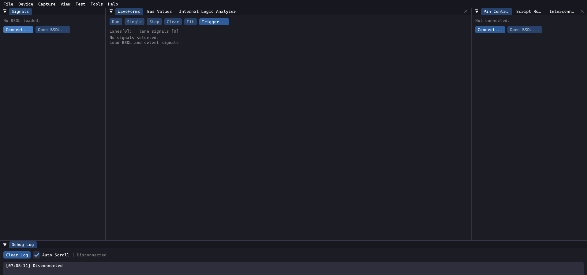
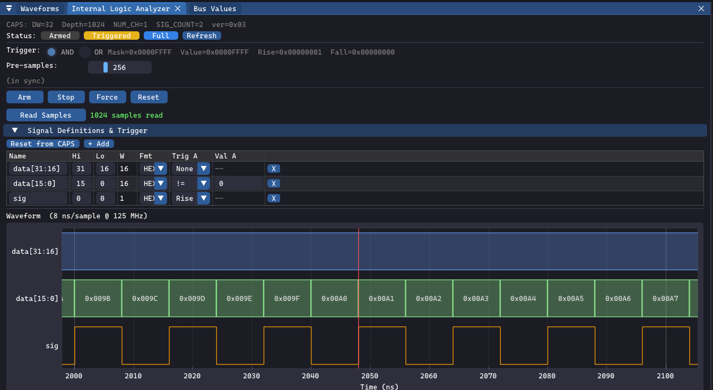
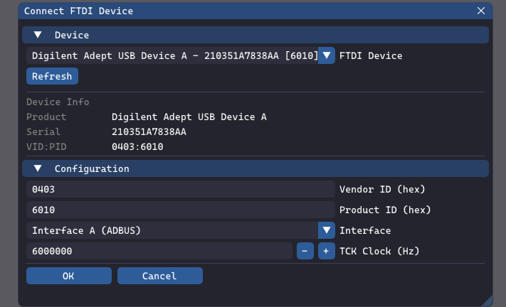

<p align="center">
  
</p>

<h1 align="center">OWLTAP</h1>

<p align="center">
  A desktop JTAG boundary-scan diagnostic and waveform capture tool for FPGA/SoC devices,
  built with FTDI MPSSE, Dear ImGui, and ImPlot.
</p>

---


**O:OpenSource**

**W:Waveform**

**L:Logger**


<p align="center">
  <br/>
  <em>GUI panel</em>
</p>


OWLTAP is a desktop application for interfacing with the JTAG TAP of an FPGA or SoC device, providing boundary-scan control, signal capture, and waveform visualization.


## Features

| Feature | Detail |
|---------|--------|
| **JTAG chain detection** | Auto-enumerates devices; reads IDCODE and IR length |
| **BSDL parsing** | Loads vendor BSDL files; maps logical pin names to BSR bit positions |
| **Boundary scan (EXTEST)** | Drive output pins HIGH/LOW/Hi-Z; read captured input values |
| **Safety guard** | Blocks EXTEST when Zynq PS\_DDR / PS\_MIO / PS\_POR\_B / PS\_SRST\_B pins detected |
| **Waveform capture** | Continuous or triggered multi-channel capture with configurable depth |
| **Trigger engine** | Rising edge, falling edge, either edge, level; pre/post-trigger ratio |
| **Embedded ILA IP** | Vendor-neutral SystemVerilog Internal Logic Analyzer core (dedicated TAP and BSCANE2 variants) for high-speed in-PL capture |
| **JTAG daemon** | All hardware operations run in a background `jtag_daemon` process; GUI and MCP clients connect via JSON-RPC TCP — no direct hardware access required in the GUI process |
| **Selective-pin capture** | GUI sends the selected signal list as a `pin_filter`; the daemon Scanner shifts out only the BSR bits needed (e.g. ~341 bits instead of 1077 for two Zynq I/O pins), improving sample rate roughly in proportion to the reduction |
| **PL bitstream programming** | Load a `.bit` / `.bin` directly into the Zynq PL via JTAG from both GUI and daemon/MCP paths |
| **ImPlot waveform view** | Zoomable, pannable signal waveform display |
| **MCP support** | Allow HW debug with your generative AI |
| **VCD export** | Standard Value Change Dump export for GTKWave / Vivado logic analyser |
| **Script engine** | Simple text script for automated set/expect sequences |
| **Config persistence** | Last device settings saved to `cfg.json` |

## Hardware Requirements

| Component | Requirement |
|-----------|-------------|
| FTDI adapter | FT2232H / FT4232H (MPSSE-capable); tested with FT4232H VID=0x0403 PID=0x6011 |
| Target device | Any IEEE 1149.1-compliant FPGA or SoC with a BSDL file |
| OS | Windows 10/11 (64-bit) |
| OpenGL | OpenGL 3.3 core profile |

Verified hardware: Xilinx Zynq XA7Z020-CLG484 PL TAP + ARM DAP via FTDI FT4232H.

## Architecture

```
┌─────────────────────────────────────┐
│          Qt6 GUI (ImGui/ImPlot)     │  ← app_window, signal_panel, waveform_view
├─────────────────────────────────────┤
│  Boundary Scan: Scanner / PinDriver │  ← BSR staging, EXTEST, capture decoding
│  Capture Engine + Trigger           │  ← ring buffer, edge/level trigger
├─────────────────────────────────────┤
│  JTAG Chain + BSDL Parser           │  ← device enumeration, pin mapping
├─────────────────────────────────────┤
│  TAP Controller  (IEEE 1149.1 FSM)  │  ← TMS path generation
├─────────────────────────────────────┤
│  MPSSE Command Buffer               │  ← FTDI protocol encoding
├─────────────────────────────────────┤
│  FtdiDevice  (libftdi1)             │  ← USB bulk transfer
└─────────────────────────────────────┘
```

## Embedded ILA IP

<p align="center">
  <br/>
  <em>ILA panel — arm, trigger, read 1024 samples at 125 MHz from in-PL capture core</em>
</p>

OwlTAP ships its Internal Logic Analyzerunder [hdl/ila/](hdl/ila/). 
 Instantiate it in your design and drive it
directly from this tool over JTAG to capture signals far above the
boundary-scan sample rate.  Unlike the Xilinx ILA, the source is open and
the JTAG register map is fully documented.

| Aspect | Detail |
|--------|--------|
| RTL location | [hdl/ila/rtl/](hdl/ila/rtl/) |
| Top-level variants | `ila_top` (dedicated TAP) / `ila_bscane2_top` (Xilinx `BSCANE2 USER1`) |
| Capture width | `DATA_W` parameter (default `32` bits) |
| Capture depth | `DEPTH` parameter (default `1024` samples; `DEPTH = 1 << ADDR_W`) |
| Trigger engine | Group A: level (mask/value) + edge (rise/fall masks); Group B: level (mask2/val2); AND/OR composition via `TRIG_CTRL.or_mode` |
| Pre/post trigger | `PRE_SAMPLES` register, default `DEPTH/4` |
| IR length (dedicated TAP) | 5 bits |
| Storage | Simple dual-port BRAM (`ram_style = "block"`), write @ `sample_clk`, read @ `tck` / `bscan_tck` |
| CDC | Toggle-pulse sync for control pulses; 2-FF `ASYNC_REG` sync for quasi-static config and status |
| IDCODE | `32'hA17A_0001` placeholder — override before production |
| Reference design | [hdl/ila/examples/zybo_z7020/](hdl/ila/examples/zybo_z7020/) (Zybo Z7-20 bring-up; verified against `ila_bringup_top.bit`) |
| Documentation | [hdl/ila/doc/integration.md](hdl/ila/doc/integration.md), [hdl/ila/rtl/rtl_spec.md](hdl/ila/rtl/rtl_spec.md) |

### Variants

- **Dedicated TAP — `ila_top`**: adds a separate IEEE 1149.1 TAP to the JTAG chain (IR = 5 bits). Use when the ILA must be reachable independently of the FPGA primary TAP, or on devices without a Xilinx BSCAN primitive.
- **BSCANE2 — `ila_bscane2_top`**: wraps a Xilinx `BSCANE2 #(.JTAG_CHAIN(1)) USER1` primitive so the ILA shares the FPGA's existing TAP. No extra JTAG pins; preferred for in-system debug on 7-Series / UltraScale parts. DR frame is `{payload[DATA_W+4:5], opcode[4:0]}` (37 bits at `DATA_W=32`), shifted LSB-first.

### Instruction / register map (dedicated TAP)

| Opcode | Mnemonic | DR width | Access | Description |
|--------|----------|----------|--------|-------------|
| `5'h01` | `IDCODE` | 32 | R | JTAG IDCODE (default after TLR) |
| `5'h02` | `CONFIG` | 32 | R | `{version[7:0], num_ch[3:0], sig_count[3:0], data_w-1[5:0], rsvd[1:0], addr_w[7:0]}`; current `VERSION = 8'h03` |
| `5'h03` | `SIG_DEF` | 32 | R | Signal-definition ROM word (auto-iterates over `SIG_COUNT` entries) |
| `5'h08` | `CTRL` | 4 | W | Bit0=ARM, Bit1=STOP, Bit2=RESET, Bit3=FORCE_TRIG (one-shot pulses) |
| `5'h09` | `STATUS` | 8 | R | `{5'b0, full, triggered, armed}` |
| `5'h0A` / `5'h0B` | `TRIG_MASK` / `TRIG_VAL` | `DATA_W` | R/W | Group A level comparator |
| `5'h0F` / `5'h10` | `TRIG_RISE` / `TRIG_FALL` | `DATA_W` | R/W | Group A edge masks |
| `5'h11` / `5'h12` | `TRIG_MASK2` / `TRIG_VAL2` | `DATA_W` | R/W | Group B level comparator |
| `5'h13` | `TRIG_CTRL` | `DATA_W` | R/W | Bit0 = `or_mode` (Group A OR B) |
| `5'h0C` | `READ_ADDR` | `ADDR_W` | R/W | BRAM read pointer |
| `5'h0D` | `READ_DATA` | `DATA_W` | R | Captured word; auto-increments `READ_ADDR` at `Update-DR` |
| `5'h0E` | `PRE_SAMPLES` | 16 | R/W | Pre-trigger sample count (low `ADDR_W` bits used) |
| `5'h1F` | `BYPASS` | 1 | — | Mandatory IEEE 1149.1 BYPASS |

### Recommended access sequence

1. Drive TMS=1 for ≥5 TCKs (Test-Logic-Reset) and read `IDCODE`.
2. Read `CONFIG` / `SIG_DEF` to discover depth, width and signal layout at runtime.
3. Program `TRIG_MASK` / `TRIG_VAL` (and optionally `TRIG_RISE` / `TRIG_FALL` / Group B / `TRIG_CTRL`) plus `PRE_SAMPLES`.
4. Issue `CTRL = 4'b0001` (ARM); poll `STATUS` until `full == 1`. Use `CTRL = 4'b1000` to force a trigger or `CTRL = 4'b0010` to stop early.
5. Set `READ_ADDR = (trigger_addr - pre_samples) mod DEPTH`, then shift `READ_DATA` `DEPTH` times to drain the buffer.

### Software side

OwlTAP drives the ILA over JTAG via [src/ila/](src/ila/) (the daemon
exposes both an `ila_top` backend and a `BSCANE2` backend).  The MCP tool
`read_ila_status` returns the live `CONFIG` and `STATUS` register
contents (version, depth, data width, signal count, armed / triggered /
full flags); the GUI's ILA panel arms the core, polls status, and reads
captured samples back into the waveform view.

> **Note:** the default `IDCODE_VAL = 32'hA17A_0001` is a development
> placeholder.  Before distributing hardware, encode a proper
> manufacturer-assigned 32-bit IDCODE or document the conflict in your
> board bring-up notes.

## Build

### Prerequisites

| Tool | Notes |
|------|-------|
| [Bazelisk](https://github.com/bazelbuild/bazelisk/releases) | Download `bazelisk-windows-amd64.exe`, rename to `bazelisk.exe`, place on `PATH` |
| Visual Studio 2022 | **Desktop development with C++** workload required (MSVC v143, Windows SDK) |
| Python 3.x | Required by Bazel host scripts; `python` must be on `PATH` |
| Pillow (optional) | `pip install pillow` — only needed for the icon-embedding post-build step |

libftdi1 and libusb-1.0 are vendored under `third_party/`; no separate installation is needed for building.

### Windows USB driver

libusb requires a WinUSB-compatible driver bound to the FTDI adapter.
Install [Zadig](https://zadig.akeo.ie/), select the FTDI interface used for JTAG (usually Interface 0 of the FT4232H), and install **WinUSB** or **libusbK**.
The FTDI COM-port driver (VCP) must **not** be bound to that interface at the same time.

### Build commands

```powershell
# Clone and enter the repository
git clone https://github.com/MameMame777/OwlTAP.git
cd OwlTAP

# Build the viewer
bazelisk build //src:jtag_viewer

# Embed the taskbar icon (requires Pillow; run once after each clean build)
Set-ItemProperty bazel-bin/src/jtag_viewer.exe -Name IsReadOnly -Value $false
python tools/embed_icon.py bazel-bin/src/jtag_viewer.exe docs/icon.png

# Run all unit tests (no hardware required)
bazelisk test //test/...

# Build with debug symbols
bazelisk build --config=debug //src:jtag_viewer

# Build the diagnostic CLI tool
bazelisk build //src/tools:jtag_diag
```

The binary is produced at `bazel-bin/src/jtag_viewer.exe`.

### BSDL files

BSDL/BSD files for your target device are **not included** in this repository.
Obtain them from your device vendor (e.g. Xilinx/AMD downloads, device datasheet package)
and load them at runtime via **Device → Load BSDL**.

## Usage

1. Connect the FTDI adapter to the target board's JTAG header.
2. Run `jtag_viewer.exe`.
3. **Device** → **Connect**: select VID/PID/serial and channel; click Connect.
4. **Device** → **Load BSDL**: choose the `.bsd` / `.bsdl` file for your target.
5. **Signal Panel**: select pins to monitor or drive.
6. **Capture** → **Start** to begin waveform acquisition.
7. **File** → **Export VCD** to save captured waveforms.

<p align="center">
  <br/>
  <em>Connect dialog — select FTDI device, interface, and TCK clock frequency</em>
</p>

<p align="center">
  <br/>
  <em>Boundary-scan waveform capture — IO_M14 and IO_M15 sampled at ~1 kHz via JTAG BSR</em>
</p>

### Sampling rate and signal bandwidth

Boundary-scan capture works by repeatedly shifting the 1077-bit BSR of the
XC7Z020 through the JTAG TAP.  The attainable sample rate is limited by two
factors:

| Factor | Contribution |
|--------|-------------|
| JTAG clock (default 6 MHz) + IR/DR overhead | ~5.5 kHz theoretical max |
| USB bulk-transfer round-trip latency (~250–500 µs) | reduces to **~1–2 kHz** in practice |

> **Rule of thumb**: signals above ~500 Hz–1 kHz will alias and cannot be
> captured faithfully.  Boundary scan is suited for slow control signals,
> power-up sequencing, and bus idle/active states — not high-speed clocks or
> fast GPIO toggles.

For high-speed signal capture, instantiate an ILA core inside your PL
design — either the **Embedded ILA IP** shipped with this project (see
the next section) or the vendor's own ILA (Xilinx Integrated Logic
Analyser).

### Script Engine

Create a plain-text script file and load it via **File** → **Run Script**:

```
# Drive LED HIGH and verify
set LED0 1
apply
expect LED0 1

# Release to Hi-Z
highz LED0
apply
```

### Programming the PL bitstream (volatile)

**Tools → Program Bitstream...** writes a `.bit` / `.bin` file directly into
the Zynq PL via JTAG (UG470 configuration sequence: `JPROGRAM` →
`CFG_IN` → `JSTART` → `DONE`).  Lost on power cycle.

Command-line equivalent:

```
bazel-bin/src/tools/pl_program.exe --bit design.bit
```

### Programming the SPI configuration ROM (non-volatile)

**Tools → Program Flash (SPI ROM)...** writes a flash image into the Micron
MT25QL128 so the board boots the design after power-cycle.  The workflow:

1. Generate a raw SPI image from Vivado:

   ```tcl
   write_cfgmem -force -format BIN -interface SPIx1 -size 16 \
                -loadbit "up 0x00000000 design.bit" design.bin
   ```

2. Download the BSCAN SPI bridge bitstream from
   [quartiq/bscan_spi_bitstreams](https://github.com/quartiq/bscan_spi_bitstreams)
   — for XC7Z020 use `bscan_spi_xc7z020.bit`.  See [assets/README.md](assets/README.md).

3. In the GUI, select **Tools → Program Flash (SPI ROM)...**, pick the bridge
   `.bit` first, then your design `.bin`.  The tool loads the bridge into the
   PL, bulk-erases the flash, programs it page-by-page, and verifies the
   read-back.

Command-line equivalent:

```
bazel-bin/src/tools/flash_program.exe --bridge bscan_spi_xc7z020.bit --bin design.bin
```

Only MT25QL128 (JEDEC `0x20BA18`, 16 MB) is currently supported.

## Project Structure

```
src/
  boundary_scan/   -- BSR staging free functions + PinDriver
  bsdl/            -- BSDL lexer, parser, model
  capture/         -- CaptureEngine ring buffer + trigger logic
  config/          -- PL JTAG configuration (UG470 sequencer)
  flash/           -- SPI config ROM programming via BSCAN bridge
  ftdi/            -- libftdi1 wrapper (FtdiDevice) + MPSSE buffer
  gui/             -- ImGui application window, panels, dialogs
  jtag/            -- JtagChain + TAP controller FSM
  script/          -- ScriptEngine (set/expect/apply/highz)
  tools/           -- jtag_diag, pl_program, flash_program CLI tools
test/              -- Google Test unit tests (no hardware required)
third_party/       -- vendored libftdi1, libusb-1.0, GLFW, ImGui, ImPlot
docs/              -- architecture references, implementation plans
```

## Testing

### Unit tests (no hardware required)

```powershell
bazelisk test //test/...
```

| Target | What it covers |
|--------|----------------|
| `//test:bsdl_parser_test` | BSDL lexer + parser; instruction opcodes; boundary-cell extraction |
| `//test:mpsse_test` | MPSSE command encoding (TMS, shift-in/out, clock divisor, bit ops) |
| `//test:tap_controller_test` | TAP state-machine transitions; TMS path generation |
| `//test:trigger_test` | Rising/falling/either-edge and level triggers; pre-trigger ratio; single-shot |
| `//test:scanner_test` | Boundary-scan decode (input-cell preference, partial BSR, empty snapshot); regression: `setDecodeFilter({})` clears stale filter |
| `//test:pin_driver_test` | BSR staging (HIGH/LOW/Hi-Z); EXTEST safety guard for Zynq PS pins; snapshot copy/mask |
| `//test:script_engine_test` | Script parser and set/expect/apply/highz executor; error reporting |
| `//test:pl_config_test` | PL bitstream bit-reversal and header stripping; status register decode |
| `//test:bus_definition_test` | Multi-bit bus value decode (MSB/LSB first, unknown-pin handling); app-config serialization |
| `//test:uart_decoder_test` | UART frame decode; parity/framing errors; multi-byte stream |
| `//test:spi_decoder_test` | SPI frame decode for modes 0–3; LSB-first; CS gap handling |
| `//test:i2c_decoder_test` | I2C write/read/repeated-start; NAK after address |
| `//test:xdc_parser_test` | XDC `set_property PACKAGE_PIN` extraction; comment/non-pin line skipping |
| `//test:spi_flash_test` | MT25Q SPI flash command encoding (read, write-enable, page-program, bulk-erase) |
| `//test:mcs_parser_test` | Intel MCS/HEX record parsing; extended address; checksum mismatch detection |
| `//test:ila_driver_test` | ILA register map (probe, config, status, trigger, read-data auto-increment); full capture flow smoke test |
| `//test:hardware_job_test` | `HardwareJob` state transitions; result/progress/error fields; cancel atomicity; JSON snapshot |
| `//test:capture_session_test` | Capture session state machine; buffer-depth and interval accessors; trigger round-trip |
| `//test:json_rpc_test` | JSON-RPC 2.0 framing and parsing; error/result shapes; multi-message stream |
| `//test:tool_registry_test` | MCP tool-registry parameter validation (required fields, type checking, null params) |
| `//test:test_suite_test` | `.suite` file parser (`parseSuiteFile`): empty/missing/comment/relative-path/inline-comment; `TestSuiteRunner::run` (missing/empty/multi scripts); `formatReport` |
| `//test:ict_parser_test` | `.ict` file parser (`parseIctFile`): empty/missing/comment/single-net/multi-net/device-index/malformed; `runInterconnectTest` (empty netlist, null driver, out-of-range, multi-net); `formatInterconnectReport` |

### Why two test layers?

| Layer | When to run | What it covers | Hardware required |
|-------|-------------|----------------|-------------------|
| `bazel test //test/...` | Every commit, CI | Logic correctness of every module in isolation; fast (< 10 s); deterministic and hermetic | No |
| Python HIL scripts | Before a release, after hardware changes | End-to-end path from Python → MCP → daemon → real JTAG chain; catches integration regressions that unit mocks cannot detect | Yes — FTDI adapter + target board |

The unit tests use fake/stub hardware (no libftdi calls at runtime) so they run
fast in any environment and are safe to run repeatedly in CI.  The HIL scripts
spawn a real `jtag_daemon.exe`, perform JTAG scans against physical silicon, and
verify observable side-effects (pin states, ILA status registers, capture
buffers) that cannot be replicated with mocks.

`.suite` and `.ict` features are tested at both layers:
- **Unit layer** — `test_suite_test` / `ict_parser_test` verify the file-format
  parsers and the runner logic using in-memory stubs.  These catch regressions
  in parsing rules without requiring a board.
- **HIL layer** — `test_hw_suite_ict.py` runs real scripts against the target,
  verifies `run_script` round-trips, and reads back pin states through the full
  daemon stack.

### Hardware-in-the-loop tests (FTDI adapter + target required)

The following Python scripts exercise the full stack against real hardware.
All scripts require Python 3.10+ (no extra dependencies).

#### `test_mcp_full.py` — comprehensive MCP integration test *(recommended)*

Starts `jtag_daemon.exe` automatically, runs every major MCP tool in sequence,
and shuts down the daemon cleanly.

```powershell
python test_mcp_full.py [bsdl_path] [daemon_exe]

# Example (defaults work if run from the repo root after a build):
python test_mcp_full.py xa7z020_clg484.bsd bazel-bin\src\tools\jtag_daemon.exe
```

| Test | MCP tool | What is verified |
|------|----------|-----------------|
| tools/list | `tools/list` | All 15 expected tool names are registered |
| detect_devices | `detect_devices` | Device count ≥ 1; IDCODE / IR-length fields present |
| load_bsdl | `load_bsdl` | Entity name returned; boundary length populated |
| list_pins | `list_pins` | ≥ 1 observable pin in the BSDL |
| read_pin | `read_pin` | Single pin returns `high` / `low` / `unknown` |
| run_script | `run_script` | `sample` + `read <pin>` script completes with `success=true` |
| capture (single) | `capture_start` + `get_samples` | Job reaches `complete`; ≥ 1 sample with pin data |
| capture (stop) | `capture_start` + `capture_stop` + `get_samples` | Free-run job stops and reaches terminal state |
| program_bitstream | `program_bitstream` + `job_poll` | Async JTAG bitstream write completes with `ok=true` |
| read_ila_status | `read_ila_status` (BSCANE2) | ILA version / depth / width / armed / triggered / full returned after PL config |

**Hardware test result (2026-04-27, xa7z020_clg484 / ila_bringup_top.bit):**

```
Result: 10/10 tests passed

[TEST] detect_devices        → 2 device(s): pos=0 IDCODE=0x23727093 IR=6, pos=1 IDCODE=0x4BA00477 IR=4
[TEST] load_bsdl             → entity='XA7Z020_CLG484'
[TEST] list_pins             → 333 observable, 327 drivable
[TEST] read_pin              → RSVDVCC3_T10 = high
[TEST] run_script            → success=True
[TEST] capture (single)      → 1 samples, 333 pins per sample
[TEST] capture (stop)        → state=cancelled
[TEST] program_bitstream     → state=complete  ok=True
[TEST] read_ila_status       → version=3  depth=1024  data_width=32  sig_count=2  armed=False
```

#### `test_hw_suite_ict.py` — .suite / .ict feature HIL test

Starts `jtag_daemon.exe` automatically, exercises the `.suite` script-runner
and the `.ict` interconnect-test parser against real hardware (SAMPLE mode
only — no EXTEST pin driving).

```powershell
# Defaults: xa7z020_clg484.bsd, bazel-bin\src\tools\jtag_daemon.exe
python test_hw_suite_ict.py

# Supply a custom .ict file (parsed + receiver pins observed via SAMPLE)
python test_hw_suite_ict.py --ict path\to\board.ict

# Override BSDL or daemon path:
python test_hw_suite_ict.py --bsdl HWsample\xa7z020_clg400.bsd
```

| Test | What is verified |
|------|------------------|
| `.suite` parse + run | Temp `.suite` file (relative paths) is parsed; each script runs via `run_script` and returns `success=true` |
| `.ict` parse + observe | `.ict` file (or auto-generated synthetic net) is parsed; every receiver pin is read via `read_pin`; state is `high`/`low`/`unknown` |

**Hardware test result (2026-04-28, xa7z020_clg484):**
```
Result: 2/2 tests passed
[TEST] .suite: parse + run_script per script file           → PASS  (3/3 scripts)
[TEST] .ict:   parse + read_pin observation (SAMPLE mode)  → PASS
```

#### `test_mcp_live.py` — basic MCP smoke test

Requires a daemon already running on port 9999.

```powershell
# Start daemon first:
.\bazel-bin\src\tools\jtag_daemon.exe --mcp-port 9999

# Run in another terminal:
python test_mcp_live.py
```

Tests: `detect_devices`, `load_bsdl`, `list_pins`.

#### GUI RPC tests

These tests talk to the daemon's internal GUI RPC endpoint (plain JSON-RPC 2.0,
no MCP handshake).  The port is printed by the daemon on startup.

| Script | Tests |
|--------|-------|
| `test_gui_rpc_bsdl.py <port> [bsdl]` | `hardware/detect_devices`, `hardware/load_bsdl`, `hardware/list_pins` |
| `test_gui_rpc_capture.py <port> [bsdl]` | Full capture flow: detect → load → `capture/start` → `capture/get_samples` poll |

```powershell
# Start daemon (GUI port is printed to stderr):
.\bazel-bin\src\tools\jtag_daemon.exe
# [jtag_daemon] GUI RPC listening on 127.0.0.1:54321

python test_gui_rpc_bsdl.py 54321
python test_gui_rpc_capture.py 54321
```

## Security

`jtag_daemon` is a **local-only developer tool**.  Its MCP and GUI-RPC TCP ports
bind exclusively to `127.0.0.1` and are never exposed on a network interface.

**Known design constraints (acceptable for a local dev tool):**

| Item | Detail |
|------|--------|
| No authentication on daemon ports | Any local process can connect and issue JTAG commands. Mitigated by loopback-only binding. Do not run the daemon on a shared machine where untrusted local users are present. |
| `bsdl_path` / file paths are not directory-restricted | Paths supplied to `load_bsdl`, `run_script`, and related tools are passed directly to the file system. Provide only trusted, well-formed paths. |
| `run_script` executes arbitrary script text | By design — the script DSL is the primary automation interface. Only connect trusted clients to the daemon. |

**Do not** expose the daemon ports externally (e.g., via SSH port-forwarding or
firewall rules) without adding an authentication layer.

## License

Original source code: **MIT License** — see [LICENSE](LICENSE).

This project vendors third-party libraries under separate licenses.
See [THIRD_PARTY_NOTICES.md](THIRD_PARTY_NOTICES.md) for details.
License texts for LGPL-covered components are in [THIRD_PARTY_LICENSES/](THIRD_PARTY_LICENSES/).
