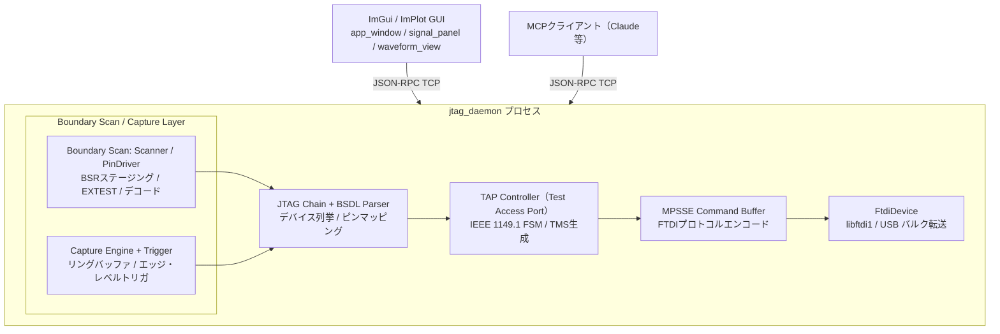
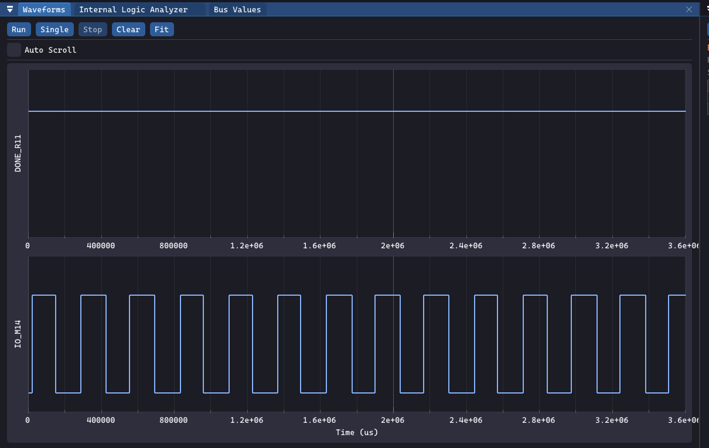

<p align="center">
  
</p>

<h1 align="center">OWLTAP</h1>

<p align="center">
  FTDI MPSSE、Dear ImGui、ImPlot で構築した、FPGA/SoC デバイス向けデスクトップ JTAG バウンダリスキャン診断・波形キャプチャツール。
</p>

<p align="center">
  <a href="README.md">English</a> | <a href="README_JP.md">日本語</a>
</p>

---

**O**pen-source **W**aveform **L**ogger for **TAP**


OWLTAP は FPGA/SoC の JTAG TAP に接続し、バウンダリスキャン制御・信号キャプチャ・波形表示を行うデスクトップアプリケーションです。

テスターやオシロスコープを使わずに、FPGAの実機デバッグを手軽に行えます。

さらに **MCP (Model Context Protocol)** に対応しており、Claude Desktop などの AI クライアントから FPGA への書き込み・バウンダリスキャン・ILA 制御を直接行えます。

> **動作環境**: Windows 10/11（64-bit）、FTDI MPSSE アダプタ（FT2232H / FT4232H）が必要です。  
> 現時点での実機検証は Zybo Z7020 (XA7Z020-CLG484) で行っています。

---

## 機能一覧

| 機能 | 概要 |
|------|------|
| **JTAGチェーン検出** | IDCODE と IR 長を自動読み取りしてデバイスを列挙 |
| **BSDLパーサ** | ベンダ BSDL ファイルを読み込み、ピン名と BSR ビット位置をマッピング |
| **バウンダリスキャン (EXTEST)** | 出力ピンを HIGH/LOW/Hi-Z に駆動、入力ピン値を読み取り |
| **安全ガード** | Zynq PS\_DDR / PS\_MIO / PS\_POR\_B / PS\_SRST\_B ピン検出時は EXTEST をブロック |
| **波形キャプチャ** | トリガ付き・フリーラン・シングル、バッファ深度可変 |
| **トリガエンジン** | 立ち上がり/立ち下がり/両エッジ/レベル、プレトリガ比率設定 |
| **内蔵ILA IP** | SystemVerilog 製ロジックアナライザ IP（専用 TAP / Xilinx BSCANE2 対応） |
| **JTAGデーモン** | ハードウェア操作をバックグラウンドプロセスに分離、JSON-RPC TCP 経由で制御 |
| **選択ピン最適化** | 選択ピンのみ BSR をシフトアウト（例: 1077bit → 341bit）でサンプルレート改善 |
| **PLビットストリーム書き込み** | `.bit`/`.bin` を JTAG 経由で Zynq PL に直接書き込み（揮発、電源断で消える） |
| **SPI フラッシュ書き込み** | BSCAN SPI ブリッジ経由で SPI Config ROM（MT25QL128）に書き込み（**実機未検証**） |
| **MCP 対応** | AI (Claude 等) から JTAG デバッグツールを呼び出し可能 |
| **VCD エクスポート** | GTKWave / Vivado で読める VCD ファイルを出力 |
| **スクリプトエンジン** | set/expect/apply/highz の自動化スクリプト |
| **設定永続化** | 最後のデバイス設定を `cfg.json` に保存 |

---

## ハードウェア要件

| コンポーネント | 要件 |
|-------------|------|
| FTDI アダプタ | FT2232H / FT4232H（MPSSE 対応）。FT232RL は MPSSE 非対応のため不可。検証済み: FT4232H VID=0x0403 PID=0x6011 |
| ターゲットデバイス | IEEE 1149.1 準拠の任意の FPGA/SoC（BSDL ファイルが必要） |
| OS | Windows 10/11（64-bit） |
| GPU | OpenGL 3.3 core profile 対応 |

検証済み構成: Xilinx Zynq XA7Z020-CLG484 PL TAP + ARM DAP (FTDI FT4232H 経由)

---

## アーキテクチャ

GUIとハードウェアは **JTAG デーモンプロセス** で分離されており、GUI は JSON-RPC over TCP でデーモンと通信します。これにより MCP クライアント（AI）や外部スクリプトからも同じハードウェア操作を利用できます。



---

## バウンダリスキャン波形キャプチャ

BSDL を読み込み、信号パネルでピンを選択。RUNボタンをクリックすることで波形キャプチャを行えます。

<p align="center">
  <br/>
  <em>バウンダリスキャン波形キャプチャ — IO_M14/IO_M15 を JTAG BSR 経由で約 1 kHz でサンプリング</em>
</p>

### サンプルレートの現実

Zynq XA7Z020 の BSR は 1077 ビットあります。これを JTAG でシフトし続けるため、理論値と実測値にはギャップがあります。

| 要因 | 影響 |
|------|------|
| JTAG クロック 6 MHz + IR/DR オーバーヘッド | 理論最大 ~5.5 kHz |
| USB バルク転送レイテンシ（250〜500 µs） | **実測 ~1〜2 kHz** に低下 |

> **目安**: 約 500 Hz〜1 kHz 以上の信号はエイリアシングが発生します。バウンダリスキャンは低速制御信号・電源投入シーケンス・バスのアイドル/アクティブ状態の観測に向いています。

**選択ピン最適化**を使うと、選択ピンが BSR 前方寄りにある場合はシフト長を大幅に削減できます（例: 2 ピン選択時に 1077 bit → 341 bit、サンプルレート約 3 倍）。

---

## 内蔵 ILA IP

高速信号を観測したい場合は、同梱の ILA IP を FPGA デザインに組み込みます。サンプルクロックを FPGA のシステムクロック（例: 125 MHz）に接続することで、バウンダリスキャンの数万倍のサンプルレートで信号を取得できます。

<p align="center">
  <br/>
  <em>ILA パネル — ARM、トリガ、125 MHz の in-PL キャプチャコアから 1024 サンプルを読み出し</em>
</p>

`DATA_W`（デフォルト 32 bit）と `DEPTH`（デフォルト 1024 サンプル）はパラメータで変更可能です。

### ILA 詳細

| 項目 | 内容 |
|------|------|
| RTL ロケーション | [hdl/ila/rtl/](hdl/ila/rtl/) |
| トップレベルバリアント | `ila_top`（専用 TAP） / `ila_bscane2_top`（Xilinx `BSCANE2 USER1`） |
| キャプチャ幅 | `DATA_W` パラメータ（デフォルト `32` bit） |
| キャプチャ深度 | `DEPTH` パラメータ（デフォルト `1024` サンプル; `DEPTH = 1 << ADDR_W`） |
| トリガエンジン | グループ A: レベル（マスク/値）＋エッジ（立上/立下マスク）; グループ B: レベル; `TRIG_CTRL.or_mode` で AND/OR 合成 |
| プレ/ポストトリガ | `PRE_SAMPLES` レジスタ（デフォルト `DEPTH/4`） |
| IR 長（専用 TAP） | 5 bit |
| ストレージ | シンプルデュアルポート BRAM（`ram_style = "block"`）。書き込み @ `sample_clk`、読み出し @ `tck` / `bscan_tck` |
| CDC | 制御パルス: トグルパルス同期; 準静的設定/ステータス: 2-FF `ASYNC_REG` 同期 |
| IDCODE | `32'hA17A_0001`（開発用プレースホルダ — 配布前に上書きすること） |
| リファレンスデザイン | [hdl/ila/examples/zybo_z7020/](hdl/ila/examples/zybo_z7020/)（Zybo Z7-20 ブリングアップ; `ila_bringup_top.bit` で検証済み） |
| ドキュメント | [hdl/ila/doc/integration.md](hdl/ila/doc/integration.md)、[hdl/ila/rtl/rtl_spec.md](hdl/ila/rtl/rtl_spec.md) |

### バリアント

| バリアント | 説明 |
|-----------|------|
| **`ila_top`**（専用 TAP） | 独立した IEEE 1149.1 TAP を JTAG チェーンに追加（IR = 5 bit）。FPGA の既存 TAP から独立させたい場合や BSCAN プリミティブ非搭載デバイス向け |
| **`ila_bscane2_top`**（BSCANE2） | Xilinx `BSCANE2 USER1` プリミティブ経由で FPGA の既存 TAP を共用。追加 JTAG ピン不要。7-Series / UltraScale のインシステムデバッグに推奨 |

### トリガ構成

- **グループ A**: レベル比較（マスク/値） + エッジ（立上/立下マスク）
- **グループ B**: 独立レベル比較
- **`TRIG_CTRL.or_mode`**: グループ A OR グループ B でトリガ

### ILA レジスタマップ（専用 TAP）

| オペコード | 名前 | DR 幅 | アクセス | 説明 |
|-----------|------|-------|---------|------|
| `5'h01` | `IDCODE` | 32 | R | JTAG IDCODE (TLR 後のデフォルト) |
| `5'h02` | `CONFIG` | 32 | R | `{version[7:0], num_ch[3:0], sig_count[3:0], data_w-1[5:0], rsvd[1:0], addr_w[7:0]}`; 現在 `VERSION = 8'h03` |
| `5'h03` | `SIG_DEF` | 32 | R | 信号定義 ROM ワード（自動インクリメント） |
| `5'h08` | `CTRL` | 4 | W | Bit0=ARM, Bit1=STOP, Bit2=RESET, Bit3=FORCE_TRIG |
| `5'h09` | `STATUS` | 8 | R | `{5'b0, full, triggered, armed}` |
| `5'h0A/0B` | `TRIG_MASK/VAL` | `DATA_W` | R/W | グループ A レベル比較 |
| `5'h0F/10` | `TRIG_RISE/FALL` | `DATA_W` | R/W | グループ A エッジマスク |
| `5'h11/12` | `TRIG_MASK2/VAL2` | `DATA_W` | R/W | グループ B レベル比較 |
| `5'h13` | `TRIG_CTRL` | `DATA_W` | R/W | Bit0 = `or_mode`（グループ A OR B） |
| `5'h0C` | `READ_ADDR` | `ADDR_W` | R/W | BRAM 読み出しポインタ |
| `5'h0D` | `READ_DATA` | `DATA_W` | R | キャプチャワード（Update-DR で自動インクリメント） |
| `5'h0E` | `PRE_SAMPLES` | 16 | R/W | プレトリガサンプル数 |
| `5'h1F` | `BYPASS` | 1 | — | IEEE 1149.1 必須 BYPASS |

### 推奨アクセスシーケンス

1. TMS=1 を ≥5 TCK 印加してテストロジックリセットし、`IDCODE` を読み取る。
2. `CONFIG` / `SIG_DEF` を読み取り、深度・幅・信号レイアウトをランタイムで検出する。
3. `TRIG_MASK` / `TRIG_VAL`（およびオプションで `TRIG_RISE` / `TRIG_FALL` / グループ B / `TRIG_CTRL`）と `PRE_SAMPLES` を設定する。
4. `CTRL = 4'b0001`（ARM）を発行し、`STATUS` の `full == 1` をポーリングする。`CTRL = 4'b1000` で強制トリガ、`CTRL = 4'b0010` で早期停止。
5. `READ_ADDR = (trigger_addr - pre_samples) mod DEPTH` をセットし、`READ_DATA` を `DEPTH` 回シフトしてバッファを読み出す。

### ソフトウェア側

OwlTAP は [src/ila/](src/ila/) 経由で ILA を JTAG 制御します（デーモンは `ila_top` バックエンドと `BSCANE2` バックエンドの両方を公開）。MCP ツール `read_ila_status` はライブの `CONFIG` / `STATUS` レジスタ内容（バージョン・深度・データ幅・信号数・armed/triggered/full フラグ）を返します。GUI の ILA パネルはコアを ARM してステータスをポーリングし、キャプチャサンプルを波形ビューに読み出します。

### ILA ジェネレータ ウィザード

**Tools → Generate ILA Core...** で、レーン定義から `BSCANE2` ILA パッケージをワンクリック生成できます。

| 出力 | 内容 |
|------|------|
| ラッパー RTL | `ila_bscane2_top` をインスタンス化するトップレベル SystemVerilog ラッパー |
| Vivado ヘルパースクリプト | `create_project.tcl` / `build_bitstream.tcl` |
| 制約ファイル | `ila_generated.xdc`（サンプルクロック制約付き） |
| パッケージ README | パラメータ・レーンマップ・Vivado バッチ使用法のサマリ |

> **注記**: デフォルトの `IDCODE_VAL = 32'hA17A_0001` は開発用プレースホルダです。ハードウェアを配布する前に、メーカー割り当ての正規 32-bit IDCODE を設定するか、ボードブリングアップノートに競合を記録してください。

---

## 接続とデバイス選択

FTDI アダプタをターゲットボードの JTAG ヘッダに接続し、接続ダイアログでデバイスを選択します。

<p align="center">
  <br/>
  <em>接続ダイアログ — FTDI デバイス・インターフェース・TCK クロック周波数を選択</em>
</p>

---

## MCP 対応：AI から JTAG デバッグ

`jtag_daemon` は MCP サーバとしても動作します。Claude Desktop などの MCP 対応 AI から以下のツールを呼び出せます。

```
detect_devices     → JTAG チェーン上のデバイスを列挙
read_idcode        → IDCODE を直接読み取り
list_devices       → ロード済みデバイス情報を一覧
load_bsdl          → BSDL ファイルをロード
list_pins          → 観測/駆動可能ピン一覧
read_pin           → 1 ピンの現在値を読み取り
set_pin            → ピンを HIGH/LOW/Hi-Z に設定
capture_start      → キャプチャ開始
capture_stop       → キャプチャ停止
get_samples        → サンプルデータ取得
program_bitstream  → PL へビットストリーム書き込み
ila_run_capture    → ILA キャプチャをトリガ・取得
read_ila_status    → ILA のステータス取得
run_script         → スクリプト実行
job_poll           → 非同期ジョブの完了待ち
job_cancel         → 非同期ジョブのキャンセル
```

「このピンが今 HIGH か LOW か確認して」と AI に頼むと、AI が MCP 経由で JTAG をたたいて答えを返してくる、という使い方ができます。

---

## スクリプトエンジン

シンプルなテキストスクリプトで自動化が可能です。**File → Run Script** で読み込みます。

```
# LED を HIGH に駆動して確認
set LED0 1
apply
expect LED0 1

# Hi-Z に戻す
highz LED0
apply
```

`.suite` ファイルで複数スクリプトをまとめて実行、`.ict` ファイルで基板インターコネクトテストも対応しています。

---

## PL ビットストリーム書き込み（揮発）

**Tools → Program Bitstream...** で `.bit` / `.bin` ファイルを JTAG 経由で Zynq PL に直接書き込みます（UG470 設定シーケンス: `JPROGRAM` → `CFG_IN` → `JSTART` → `DONE`）。電源断で消えるため、反復デバッグに便利です。MCP 経由（`program_bitstream`）でも呼び出せます。

コマンドライン等価:

```
bazel-bin/src/tools/pl_program.exe --bit design.bit
```

---

## SPI フラッシュ書き込み（不揮発）

> **注意**: この機能はユニットテスト済みですが、**実機での動作確認はまだ行っていません**。

BSCAN SPI ブリッジ経由で SPI Config ROM（MT25QL128）に書き込みます。電源断後も設定が保持されます。

手順:
1. Vivado で生の SPI イメージを生成します:
   ```tcl
   write_cfgmem -force -format BIN -interface SPIx1 -size 16 \
                -loadbit "up 0x00000000 design.bit" design.bin
   ```
2. [quartiq/bscan_spi_bitstreams](https://github.com/quartiq/bscan_spi_bitstreams) から XC7Z020 用ブリッジビットストリーム (`bscan_spi_xc7z020.bit`) をダウンロードします。詳細: [assets/README.md](assets/README.md)
3. **Tools → Program Flash (SPI ROM)...** でブリッジ `.bit` を先に選択し、次に書き込み `.bin` を選択します。

コマンドライン等価:

```
bazel-bin/src/tools/flash_program.exe --bridge bscan_spi_xc7z020.bit --bin design.bin
```

対応フラッシュ: MT25QL128 のみ（JEDEC `0x20BA18`, 16 MB）。

---

## ビルド方法

> **対応環境**: Windows 10/11 (64-bit)、OpenGL 3.3 core profile 対応 GPU が必要です。Linux/macOS は現時点で未対応です。

### 必要なもの

| ツール | 備考 |
|--------|------|
| [Bazelisk](https://github.com/bazelbuild/bazelisk/releases) | `bazelisk-windows-amd64.exe` を `bazelisk.exe` にリネームして PATH に配置 |
| Visual Studio 2022 | **C++ デスクトップ開発** ワークロード必須（MSVC v143、Windows SDK） |
| Python 3.x | Bazel ホストスクリプト用。`python` が PATH に通っていること |

libftdi1 と libusb-1.0 はリポジトリ内の `third_party/` に同梱済みで、別途インストール不要です。

### Windows USB ドライバ

[Zadig](https://zadig.akeo.ie/) で FTDI アダプタの JTAG インターフェース（通常 FT4232H の Interface 0）に **WinUSB** または **libusbK** を割り当てます。FTDI VCP ドライバと同時にバインドしないでください。

### ビルドコマンド

```powershell
git clone https://github.com/MameMame777/OWLTAP.git
cd OWLTAP

# ビルド
bazelisk build //src:owltap

# 全ユニットテスト実行（ハードウェア不要）
bazelisk test //test/...

# デバッグシンボル付きビルド
bazelisk build --config=debug //src:owltap

# 診断 CLI ツールのビルド
bazelisk build //src/tools:jtag_diag
```

ビルド成果物: `bazel-bin/src/owltap.exe`

### BSDL ファイルについて

ターゲットデバイスの BSDL ファイルはリポジトリに含まれていません。デバイスベンダ（Xilinx/AMD の場合はダウンロードセンター）から入手し、GUI の **Device → Load BSDL** で読み込んでください。

---

## 使い方（クイックスタート）

1. FTDI アダプタとターゲットボードの JTAG ヘッダを接続する
2. `owltap.exe` を起動する
3. **Device → Connect**: VID/PID/シリアル/チャンネルを選択して接続
4. **Device → Load BSDL**: ターゲットの `.bsd` / `.bsdl` ファイルを読み込む
5. **Signal Panel**: 監視/駆動したいピンを選択する
6. **Capture → Start**: 波形取得を開始する
7. **File → Export VCD**: 取得した波形を VCD ファイルに保存する（GTKWave / Vivado で開ける）

---

## プロジェクト構成

```
src/
  boundary_scan/   -- BSR ステージング自由関数 + PinDriver
  bsdl/            -- BSDL レキサ・パーサ・モデル
  capture/         -- CaptureEngine リングバッファ + トリガロジック
  config/          -- PL JTAG 設定（UG470 シーケンサ）
  flash/           -- BSCAN ブリッジ経由の SPI Config ROM 書き込み
  ftdi/            -- libftdi1 ラッパー (FtdiDevice) + MPSSE バッファ
  gui/             -- ImGui アプリケーションウィンドウ・パネル・ダイアログ
  ila/             -- ILA ドライバ（専用 TAP / BSCANE2 バックエンド）
  jtag/            -- JtagChain + TAP コントローラ FSM
  mcp/             -- MCP サーバ・ツールレジストリ
  script/          -- ScriptEngine (set/expect/apply/highz)
  tools/           -- jtag_diag, pl_program, flash_program, jtag_daemon CLI
test/              -- Google Test ユニットテスト（ハードウェア不要）
third_party/       -- vendored libftdi1, libusb-1.0, GLFW, ImGui, ImPlot
hdl/ila/           -- ILA IP RTL（Apache-2.0）・テストベンチ・サンプルデザイン
docs/              -- アーキテクチャ参照・実装計画
```

---

## テスト

### ユニットテスト（ハードウェア不要）

```powershell
bazelisk test //test/...
```

| ターゲット | カバー内容 |
|-----------|-----------|
| `bsdl_parser_test` | BSDL レキサ・パーサ、命令オペコード、バウンダリセル抽出 |
| `mpsse_test` | MPSSE コマンドエンコーディング（TMS、シフト in/out、クロック除算器） |
| `tap_controller_test` | TAP ステートマシン遷移、TMS パス生成 |
| `trigger_test` | 立ち上がり/立ち下がり/両エッジ・レベルトリガ、プレトリガ比率 |
| `scanner_test` | バウンダリスキャンデコード（入力セル優先、部分 BSR、空スナップショット） |
| `pin_driver_test` | BSR ステージング（HIGH/LOW/Hi-Z）、Zynq PS ピン EXTEST 安全ガード |
| `script_engine_test` | スクリプトパーサと set/expect/apply/highz 実行 |
| `pl_config_test` | PL ビットストリームのビット反転・ヘッダ除去、ステータスレジスタデコード |
| `ila_driver_test` | ILA レジスタマップ（設定・ステータス・トリガ・データ読み出し）スモークテスト |
| `hardware_job_test` | HardwareJob 状態遷移、結果/進捗/エラーフィールド、キャンセル原子性 |
| `capture_session_test` | キャプチャセッション状態マシン、バッファ深度・インターバル、トリガラウンドトリップ |
| `json_rpc_test` | JSON-RPC 2.0 フレーミング・パース、エラー/結果形式、マルチメッセージストリーム |
| `tool_registry_test` | MCP ツールレジストリのパラメータ検証（必須フィールド、型チェック） |
| `test_suite_test` | `.suite` ファイルパーサ・TestSuiteRunner・formatReport |
| `ict_parser_test` | `.ict` ファイルパーサ・runInterconnectTest・formatInterconnectReport |
| その他 | bus_definition, uart/spi/i2c_decoder, xdc_parser, spi_flash, mcs_parser |

### ハードウェアインザループ (HIL) テスト

以下の Python スクリプトは実際のハードウェアに対して全スタックを検証します。Python 3.10+ 必須（追加依存なし）。

#### `test_mcp_full.py` — MCP 統合テスト（推奨）

`jtag_daemon.exe` を自動起動し、主要 MCP ツールを順番に実行して、正常終了後にデーモンをシャットダウンします。

```powershell
python test_mcp_full.py [bsdl_path] [daemon_exe]

# 例（リポジトリルートからビルド後に実行する場合はデフォルト値で動作）:
python test_mcp_full.py xa7z020_clg484.bsd bazel-bin\src\tools\jtag_daemon.exe
```

#### HIL テスト結果（2026-04-27、XA7Z020-CLG484）

```
Result: 10/10 tests passed

detect_devices   → 2 device(s): IDCODE=0x23727093, IDCODE=0x4BA00477
load_bsdl        → entity='XA7Z020_CLG484'
list_pins        → 333 observable, 327 drivable
read_pin         → RSVDVCC3_T10 = high
capture (single) → 1 samples, 333 pins per sample
program_bitstream→ state=complete  ok=True
read_ila_status  → version=3  depth=1024  data_width=32  sig_count=2
```

### テスト戦略

| 層 | 実行タイミング | ハードウェア要否 |
|---|-------------|----------------|
| `bazelisk test //test/...`（22 テスト） | 毎コミット / CI | 不要（< 10 秒） |
| Python HIL スクリプト | リリース前・ハードウェア変更後 | 必要（FTDI アダプタ＋ターゲット基板） |

---

## セキュリティ

`jtag_daemon` はローカル専用の開発ツールです。

- MCP / GUI-RPC ポートは **127.0.0.1 のみにバインド** し、ネットワークインターフェースには露出しません
- 認証機能はありません（ループバック限定のため設計上許容）
- 共有マシンや不特定多数がアクセスできる環境での使用は避けてください

---

## ライセンス

| 対象 | ライセンス |
|------|-----------|
| C++ ソースコード（GUI アプリ・デーモン） | MIT |
| ILA IP RTL / テストベンチ（`hdl/ila/`） | Apache-2.0 |
| サードパーティライブラリ | 各ライブラリのライセンス（[THIRD_PARTY_NOTICES.md](THIRD_PARTY_NOTICES.md) 参照） |

ILA IP に **Apache-2.0** を選んだのは、再利用可能なハードウェア IP として特許許諾条項（Patent Grant）を明示するためです。Apache-2.0 はコントリビュータの保有特許についてロイヤルティフリーのライセンスを明示的に付与するため、IP コアを自社製品に組み込む際の法的明確性が高まります。

---

## 参考リンク

- リポジトリ: https://github.com/MameMame777/OWLTAP
- libftdi1: https://www.intra2net.com/en/developer/libftdi/
- Dear ImGui: https://github.com/ocornut/imgui
- ImPlot: https://github.com/epezent/implot
- Zadig（WinUSB ドライバ）: https://zadig.akeo.ie/
- IEEE 1149.1 JTAG 規格
- Xilinx UG470（7-Series Configuration User Guide）
