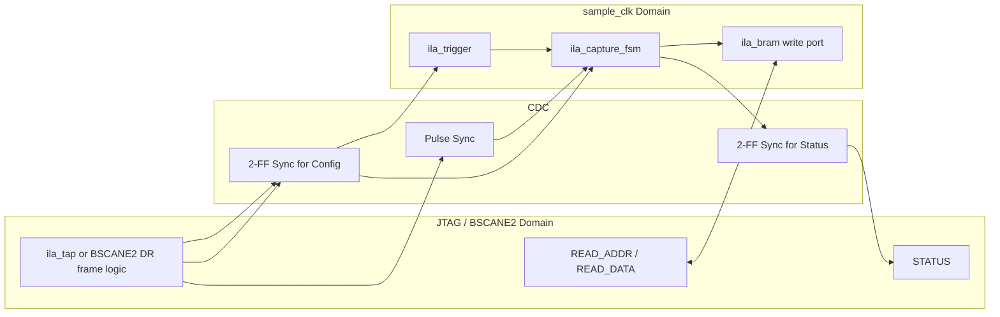
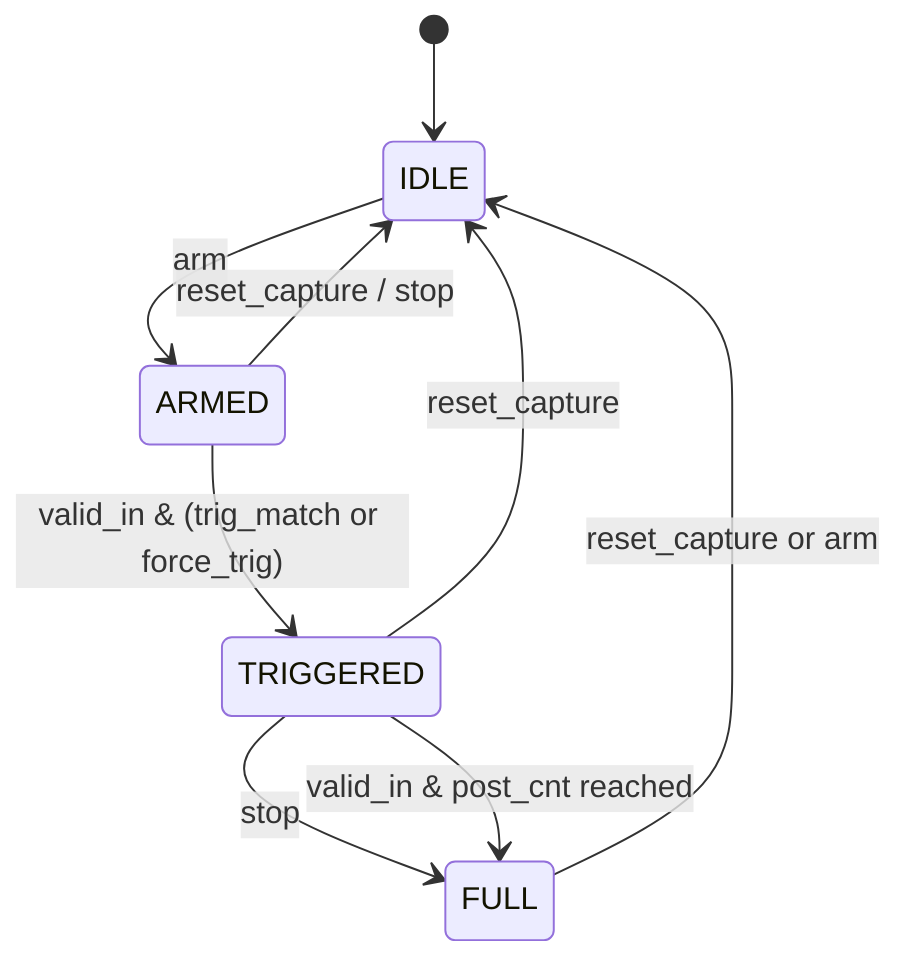

# OwlTAP ILA RTL仕様書

## 1. 文書の目的

本書は `hdl/ila/rtl` 配下の SystemVerilog 実装を対象とした RTL 仕様書である。
主に以下を目的とする。

- RTL モジュールの責務と接続関係を明確化する
- JTAG / BSCANE2 から見たレジスタ仕様を定義する
- `sample_clk` ドメイン側のトリガ・キャプチャ動作を明確化する
- 実装依存の動作、制約、運用上の注意を残す

本書の記載は、現行実装の以下ファイルに対応する。

- `ila_top.sv`
- `ila_tap.sv`
- `ila_bscane2_top.sv`
- `ila_trigger.sv`
- `ila_capture_fsm.sv`
- `ila_bram.sv`

## 2. システム概要

OwlTAP ILA は、ユーザロジックの `data_in` を `sample_clk` でサンプリングし、
トリガ条件成立前後の波形を BRAM に保存し、JTAG 経由で読出すための
組み込み ILA IP である。

アクセス方式は 2 種類ある。

| バリアント | RTL トップ | 特徴 |
|---|---|---|
| 専用 TAP 版 | `ila_top` | IEEE 1149.1 TAP を独自実装 |
| BSCANE2 版 | `ila_bscane2_top` | Xilinx `BSCANE2 USER1` を利用 |

両者は JTAG フロントエンドこそ異なるが、トリガ判定、キャプチャ FSM、
デュアルポート BRAM というデータ捕捉の中核構成は共通である。

## 3. RTL 構成

### 3.1 モジュール一覧

| ファイル | モジュール | 役割 |
|---|---|---|
| `ila_top.sv` | `ila_top` | 専用 TAP 版トップレベル |
| `ila_tap.sv` | `ila_tap` | 16 状態 TAP FSM、IR/DR、TDO 制御 |
| `ila_bscane2_top.sv` | `ila_bscane2_top` | BSCANE2 経由アクセス版トップレベル |
| `ila_trigger.sv` | `ila_trigger` | レベル + エッジ条件判定 |
| `ila_capture_fsm.sv` | `ila_capture_fsm` | ARM / TRIGGER / FULL 制御 |
| `ila_bram.sv` | `ila_bram` | `sample_clk` 書込み / JTAG 側読出し BRAM |
| `ila_top.sv` | `pulse_sync` | `tck -> sample_clk` のイベント同期 |
| `ila_bscane2_top.sv` | `bscane2_pulse_sync` | `bscan_tck -> sample_clk` のイベント同期 |

### 3.2 ブロック図

## 4. パラメータ仕様

### 4.1 共通パラメータ

| パラメータ | デフォルト | 内容 |
|---|---|---|
| `DATA_W` | `32` | キャプチャデータ幅 |
| `DEPTH` | `1024` | キャプチャサンプル数 |
| `ADDR_W` | `10` | アドレス幅。`DEPTH == 2**ADDR_W` が前提 |
| `NUM_CH` | `1` | 将来拡張用。現状は 1 チャネル前提 |
| `IDCODE_VAL` | `32'hA17A_0001` | JTAG IDCODE |
| `SIG_COUNT` | `1` | `SIG_DEF` で報告する信号定義数 |
| `SIG_HI[0:14]` | 実装既定値 | `SIG_DEF` 上位ビット番号 |
| `SIG_LO[0:14]` | 実装既定値 | `SIG_DEF` 下位ビット番号 |
| `SIG_FMT[0:14]` | 実装既定値 | `SIG_DEF` 表示形式 |

### 4.2 制約

- `DEPTH == 2**ADDR_W` を満たすこと
- `SIG_COUNT` は `1..15` を想定
- `PRE_SAMPLES` は実使用上 `0..DEPTH-1`
- `DATA_W` は BSCANE2 版では 32bit 運用を前提とする

## 5. クロック / リセット構成

### 5.1 クロックドメイン

| ドメイン | 代表クロック | 主な処理 |
|---|---|---|
| JTAG ドメイン | `tck` | TAP FSM、IR/DR、レジスタアクセス |
| BSCANE2 ドメイン | `bscan_tck` | DR フレーム処理、JTAG レジスタアクセス |
| サンプルドメイン | `sample_clk` | トリガ判定、キャプチャ、BRAM 書込み |

### 5.2 リセット

| モジュール | リセット信号 | 極性 |
|---|---|---|
| `ila_tap` | `trst_n` | Low アクティブ |
| `ila_top` 内 `sample_clk` ロジック | `sample_rst_n` | Low アクティブ |
| `ila_bscane2_top` JTAG 側 | `tck_rst_n = ~bscan_reset` | Low アクティブ |
| `ila_bscane2_top` `sample_clk` 側 | `sample_rst_n` | Low アクティブ |

### 5.3 CDC 方針

| 向き | 対象 | 実装方式 |
|---|---|---|
| JTAG -> `sample_clk` | `arm`, `stop`, `reset`, `force_trig` | トグル同期 + 2/3 段 FF + XOR エッジ検出 |
| JTAG -> `sample_clk` | `trig_mask`, `trig_value`, `pre_samples` など | `ASYNC_REG` 付き 2 段 FF |
| `sample_clk` -> JTAG | `armed`, `triggered`, `full` | `ASYNC_REG` 付き 2 段 FF |
| `sample_clk` <-> JTAG | キャプチャデータ | デュアルポート BRAM |

注記:
設定ワードは準静的として扱う。ソフトウェアは `ARM` 発行前に十分な
安定時間を置くことを前提とする。

## 6. `ila_top` 仕様

### 6.1 役割

`ila_top` は専用 JTAG TAP を持つ ILA のトップレベルである。

- `ila_tap` が JTAG 命令 / データレジスタを処理
- 制御パルスを `pulse_sync` で `sample_clk` 側へ転送
- `ila_trigger` がトリガ一致を判定
- `ila_capture_fsm` がキャプチャ状態を制御
- `ila_bram` が波形を保存

### 6.2 TDO の扱い

`ila_tap` は `tdo_oe` を持つ。
`ila_top` では以下のように処理する。

- `tdo_oe=1`: `ila_tap` の `tdo_int` を出力
- `tdo_oe=0`: `tdi` をそのまま `tdo` に通す

これにより、下流デバイスとのデイジーチェーンが可能である。

## 7. `ila_bscane2_top` 仕様

### 7.1 役割

`ila_bscane2_top` は Xilinx `BSCANE2 #(.JTAG_CHAIN(1))` を用いて、
FPGA 内蔵 JTAG ポートから ILA を操作するためのトップレベルである。

### 7.2 特徴

- 外部専用 JTAG ピン不要
- DR スキャンだけで opcode + data を扱う
- 内部で `stored_ir` を保持し、次回 `CAPTURE` の読出し対象を決定
- `SIMULATION` 時は testbench 接続用の JTAG ポートを追加可能

### 7.3 37-bit フレーム

既定の `DATA_W=32` では DR フレーム幅は 37bit。

| ビット | 内容 |
|---|---|
| `[4:0]` | sub-opcode |
| `[36:5]` | data payload |

シフト順は LSB-first である。

### 7.4 読出しシーケンス

1. 1 回目の DR スキャンで `opcode` を送る
2. `UPDATE` で `stored_ir` が更新される
3. 次の `CAPTURE` で `stored_ir` に対応するデータをロードする
4. 2 回目の DR スキャン TDO でデータを取得する

このため、opcode を切り替えた直後の最初のスキャンは
「選択 / prime scan」として働く。

### 7.5 書込みシーケンス

書込み可能レジスタは、DR スキャン 1 回の `UPDATE` で更新される。

## 8. `ila_tap` 仕様

### 8.1 TAP FSM

`ila_tap` は IEEE 1149.1 準拠の 16 状態 TAP FSM を実装する。

- `TEST_LOGIC_RESET`
- `RUN_TEST_IDLE`
- `SELECT_DR_SCAN`
- `CAPTURE_DR`
- `SHIFT_DR`
- `EXIT1_DR`
- `PAUSE_DR`
- `EXIT2_DR`
- `UPDATE_DR`
- `SELECT_IR_SCAN`
- `CAPTURE_IR`
- `SHIFT_IR`
- `EXIT1_IR`
- `PAUSE_IR`
- `EXIT2_IR`
- `UPDATE_IR`

状態遷移は `posedge tck` で更新される。
`tdo` は `negedge tck` で更新される。

### 8.2 IR 仕様

- IR 幅: 5bit
- リセット時のラッチ値: `IR_IDCODE`
- `CAPTURE_IR` 時の取り込み値: `..01`

| Opcode | 名称 | DR 幅 | 属性 | 説明 |
|---|---|---:|---|---|
| `5'h01` | `IDCODE` | 32 | R | IDCODE |
| `5'h02` | `CONFIG` | 32 | R | 構成情報 |
| `5'h03` | `SIG_DEF` | 32 | R | 信号定義 ROM |
| `5'h08` | `CTRL` | 4 | W | 制御パルス |
| `5'h09` | `STATUS` | 8 | R | ステータス |
| `5'h0A` | `TRIG_MASK` | `DATA_W` | R/W | Group A マスク |
| `5'h0B` | `TRIG_VAL` | `DATA_W` | R/W | Group A 比較値 |
| `5'h0C` | `READ_ADDR` | `ADDR_W` | R/W | 読出しアドレス |
| `5'h0D` | `READ_DATA` | `DATA_W` | R | 読出しデータ |
| `5'h0E` | `PRE_SAMPLES` | 16 | R/W | プリトリガ量 |
| `5'h0F` | `TRIG_RISE` | `DATA_W` | R/W | 立上り検出マスク |
| `5'h10` | `TRIG_FALL` | `DATA_W` | R/W | 立下り検出マスク |
| `5'h11` | `TRIG_MASK2` | `DATA_W` | R/W | Group B マスク |
| `5'h12` | `TRIG_VAL2` | `DATA_W` | R/W | Group B 比較値 |
| `5'h13` | `TRIG_CTRL` | `DATA_W` | R/W | bit0=`or_mode` |
| `5'h1F` | `BYPASS` | 1 | R/W | BYPASS |

### 8.3 `CONFIG`

`CONFIG` は読み出し専用 32bit レジスタであり、以下のビット構成を持つ。

| ビット | 内容 |
|---|---|
| `[31:24]` | `VERSION = 8'h03` |
| `[23:20]` | `NUM_CH` |
| `[19:16]` | `SIG_COUNT` |
| `[15:10]` | `DATA_W - 1` |
| `[9:8]` | 予約 |
| `[7:0]` | `ADDR_W` |

`VERSION=3` は、Group B トリガと `TRIG_CTRL` を含む現行実装世代を表す。

### 8.4 `SIG_DEF`

`SIG_DEF` は 32bit の信号定義ワードを返す。

| ビット | 内容 |
|---|---|
| `[31:28]` | `fmt` |
| `[27:24]` | 予約 |
| `[23:16]` | `hi` |
| `[15:8]` | `lo` |
| `[7:0]` | `name_idx`。現状は `8'hFF` 固定 |

`sig_def_idx` の動作:

- リセット時: `0`
- `UPDATE_IR` 時: `0`
- `IR_SIG_DEF` の `UPDATE_DR` 時: インクリメント
- `SIG_COUNT-1` の次: `0` にラップ

### 8.5 `CTRL`

`CTRL` は `UPDATE_DR` 時に 1 サイクルパルスを出力する。

| bit | 信号 | 内容 |
|---|---|---|
| `[0]` | `ctrl_arm` | ARM |
| `[1]` | `ctrl_stop` | STOP |
| `[2]` | `ctrl_reset` | RESET |
| `[3]` | `ctrl_force_trig` | FORCE_TRIG |

### 8.6 `STATUS`

`STATUS` は読み出し専用 8bit。

| bit | 内容 |
|---|---|
| `[0]` | `armed` |
| `[1]` | `triggered` |
| `[2]` | `full` |
| `[7:3]` | 0 |

### 8.7 `READ_ADDR` / `READ_DATA`

- `READ_ADDR` は BRAM 読出しポインタ
- `READ_DATA` は `CAPTURE_DR` 時に `rd_data` をロード
- `READ_DATA` の `UPDATE_DR` で `READ_ADDR` を `+1` 自動更新

このため、`READ_DATA` を連続スキャンすることでバッファを逐次読出しできる。

### 8.8 `PRE_SAMPLES`

- 内部保持幅は 16bit
- 出力時は `pre_reg[ADDR_W-1:0]` を使用
- リセット既定値は `DEPTH/4`

注記:
ソフトウェア側は通常 `ADDR_W` 幅相当のみを意味のある値として扱えばよい。

### 8.9 TDO 制御

- `SHIFT_IR` 時: `ir_shift[0]`
- `SHIFT_DR` 時: 選択 DR の LSB
- それ以外: `tdo_oe=0`

`tdo` / `tdo_oe` は `negedge tck` でレジスタ出力される。

## 9. `ila_trigger` 仕様

### 9.1 入力 / 出力

| 信号 | 内容 |
|---|---|
| `data_in` | 現在サンプル |
| `valid_in` | サンプル有効 |
| `mask`, `value` | Group A レベル判定 |
| `rise_mask`, `fall_mask` | Group A エッジ判定 |
| `mask2`, `val2` | Group B レベル判定 |
| `or_mode` | Group 合成モード |
| `match` | トリガ一致パルス |

### 9.2 Group A

Group A はレベル条件とエッジ条件の積で構成される。

- `level_ok_a = (mask == 0) OR ((data_in & mask) == (value & mask))`
- `rising = ~prev_data & data_in`
- `falling = prev_data & ~data_in`
- `edge_ok_a` は以下のいずれかで成立
  - `rise_mask == 0` かつ `fall_mask == 0`
  - `(rising & rise_mask) != 0`
  - `(falling & fall_mask) != 0`

Group A が有効と見なされる条件:

- `mask != 0` または `rise_mask != 0` または `fall_mask != 0`

### 9.3 Group B

Group B はレベル条件のみで構成される。

- `level_ok_b = (mask2 == 0) OR ((data_in & mask2) == (val2 & mask2))`
- Group B 有効条件は `mask2 != 0`

### 9.4 条件合成

`or_mode=0`:

- すべての有効 Group が同時一致したとき発火
- Group B が無効なら Group A 単独判定に縮退
- どちらの Group も無効なら発火しない

`or_mode=1`:

- `match_a OR match_b`

### 9.5 `prev_data` の扱い

`prev_data` は `valid_in=1` のサイクルにのみ更新される。
したがってエッジ判定も `valid_in` にゲートされたサンプル列に対して行われる。

### 9.6 `match`

`match` は `valid_in & fire_w` を 1 サイクル遅れでレジスタ出力する。

## 10. `ila_capture_fsm` 仕様

### 10.1 状態一覧

| 状態 | 内容 |
|---|---|
| `ST_IDLE` | 待機状態 |
| `ST_ARMED` | プリトリガ収集中 |
| `ST_TRIGGERED` | ポストトリガ収集中 |
| `ST_FULL` | キャプチャ完了 |

### 10.2 状態遷移

### 10.3 動作詳細

- `ST_IDLE -> ST_ARMED` 遷移時:
  - `write_addr <= 0`
  - `post_cnt <= 0`
  - `trigger_addr <= 0`
- `ST_ARMED` 中:
  - `valid_in=1` なら `write_en=1`
  - `write_addr` は毎サンプル加算し、自然ラップする
- `ST_ARMED -> ST_TRIGGERED` 遷移時:
  - `trigger_addr <= 現在の write_addr`
- `ST_TRIGGERED` 中:
  - `post_cnt` をカウント
  - `DEPTH - pre_samples` 個の追加サンプル収集で `ST_FULL`
- `ST_FULL` 中:
  - キャプチャ停止状態を保持

### 10.4 出力

| 信号 | 定義 |
|---|---|
| `write_en` | `valid_in && (state==ST_ARMED || state==ST_TRIGGERED)` |
| `armed` | `state==ST_ARMED` |
| `triggered` | `state==ST_TRIGGERED || state==ST_FULL` |
| `full` | `state==ST_FULL` |

### 10.5 `post_target`

`post_target = DEPTH - pre_samples`

内部では `ADDR_W+1` 幅で演算される。

### 10.6 運用上の注意

`ST_FULL` 中の `arm` は即再アームではなく `ST_IDLE` への遷移条件である。
そのため、キャプチャ完了後に再開する場合は以下のいずれかが必要となる。

- `ARM` を 2 回発行する
- `RESET` 後に `ARM` を発行する

## 11. `ila_bram` 仕様

### 11.1 機能

`ila_bram` は simple dual-port BRAM として動作する。

- 書込みポート: `wr_clk = sample_clk`
- 読出しポート: `rd_clk = tck` または `bscan_tck`
- 読出しは同期読出し

### 11.2 制約チェック

シミュレーション時に以下を確認する。

- `(1 << ADDR_W) == DEPTH`

不一致時は `fatal` で停止する。

### 11.3 実装属性

- `(* ram_style = "block" *)`

## 12. リセット値

| 項目 | リセット値 |
|---|---|
| `ir_latched` | `IDCODE` |
| `stored_ir` (`BSCANE2`) | `IDCODE` |
| `sig_def_idx` | `0` |
| `trig_mask` / `trig_value` | `0` |
| `trig_rise_mask` / `trig_fall_mask` | `0` |
| `trig_mask2` / `trig_val2` | `0` |
| `trig_or_mode` | `0` |
| `pre_samples` | `DEPTH/4` |
| `rd_addr` | `0` |
| `capture_fsm.state` | `ST_IDLE` |
| `write_addr` / `trigger_addr` / `post_cnt` | `0` |
| `tdo` / `tdo_oe` | `0` |

## 13. ソフトウェアから見た推奨アクセス手順

### 13.1 専用 TAP 版

1. TAP を `Test-Logic-Reset` に入れる
2. `IDCODE` を読んでデバイス確認
3. 必要に応じて `CONFIG` / `SIG_DEF` を読む
4. `TRIG_MASK`, `TRIG_VAL`, `TRIG_RISE`, `TRIG_FALL`,
   `TRIG_MASK2`, `TRIG_VAL2`, `TRIG_CTRL`, `PRE_SAMPLES` を設定
5. `CTRL.ARM=1` を発行
6. `STATUS.full=1` を待つ
7. `READ_ADDR` を設定
8. `READ_DATA` を連続スキャンして波形を取得

### 13.2 BSCANE2 版

1. USER1 チェーンを選択
2. 読みたいレジスタの opcode を含む DR スキャンを 1 回実施
3. 同じ opcode で再度 DR スキャンし、読出し値を取得
4. 書込みは opcode + data の DR スキャン 1 回で実施

## 14. 制約事項 / 既知仕様

- 現状は 1 チャネル前提
- データ圧縮なし
- シーケンシャルトリガなし
- ストレージクオリファイアなし
- `READ_DATA` は連続読出し向けに auto-increment を行う
- 読出し中に書込みが継続すると観測値が不安定になる可能性がある
- 基本運用として `full=1` または `stop` 後の読出しを推奨する
- `IDCODE_VAL` は開発用プレースホルダであり、製品適用時は見直しが必要

